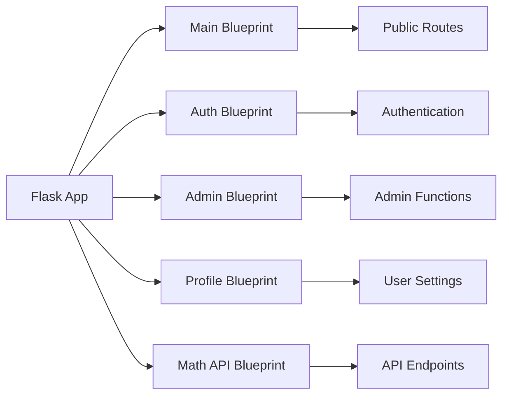

## Overview

The Maths Society Platform uses **Flask Blueprints** to organize routes into logical, modular components. This architecture provides:

- **Separation of Concerns**: Each blueprint handles a specific domain
- **Maintainability**: Isolated route definitions and templates
- **Scalability**: Easy to add new modules without affecting existing code
- **Testability**: Blueprints can be tested independently

## Blueprint Registration

Blueprints are registered in the application factory (`app/__init__.py:211`):

```python
def register_blueprints(app):
    """Register application blueprints"""
    from app.auth import bp as auth_bp
    from app.main import bp as main_bp
    from app.profile import bp as profile_bp
    from app.admin import bp as admin_bp
    from app.math_api import math_api

    app.register_blueprint(auth_bp)
    app.register_blueprint(main_bp)
    app.register_blueprint(profile_bp, url_prefix="/profile")
    app.register_blueprint(admin_bp)
    app.register_blueprint(math_api)
```

## Blueprint Structure



---

## Main Blueprint

**URL Prefix**: `/` (root)

**Purpose**: Public-facing routes including challenges, leaderboards, and content.

**Location**: `app/main/`

### Routes

#### Homepage & Information

<ParamField path="/" type="GET">
  **Homepage**: Main landing page with platform overview
  
  **Template**: `main/index.html`
</ParamField>

<ParamField path="/home" type="GET">
  **Alternative homepage route**
  
  Redirects to `/` for consistency
</ParamField>

<ParamField path="/about" type="GET">
  **About page**: Platform information and mission
</ParamField>

<ParamField path="/privacy_policy" type="GET">
  **Privacy Policy**: GDPR compliance and data handling
</ParamField>

#### Challenges

<ParamField path="/challenges" type="GET">
  **Challenge list**: Browse all available challenges
  
  **Filters**:
  - By key stage (KS3, KS4, KS5)
  - By release date
  - By lock status
</ParamField>

<ParamField path="/challenges/<int:challenge_id>" type="GET POST">
  **Challenge detail page**
  
  **GET**: Display challenge content and answer boxes
  
  **POST**: Submit answers for validation
  
  **Authentication**: Required
  
  **Example**:
  ```python
  @bp.route("/challenges/<int:challenge_id>", methods=["GET", "POST"])
  @login_required
  def challenge_detail(challenge_id):
      challenge = Challenge.query.get_or_404(challenge_id)
      
      if request.method == "POST":
          # Process answer submissions
          for answer_box in challenge.answer_boxes:
              submitted = request.form.get(f"answer_{answer_box.id}")
              is_correct = answer_box.check_answer(submitted)
              # Create AnswerSubmission record
      
      return render_template("main/challenge_detail.html", 
                            challenge=challenge)
  ```
</ParamField>

#### Summer/Autumn Challenges

<ParamField path="/autumn_about" type="GET">
  **Autumn competition information**
</ParamField>

<ParamField path="/autumn_challenge/<int:challenge_id>" type="GET POST">
  **Autumn challenge detail** (similar to regular challenges)
</ParamField>

#### Content & Articles

<ParamField path="/articles" type="GET">
  **Article list**: Browse educational articles
  
  **Query Parameters**:
  - `type`: Filter by article type ("article" or "newsletter")
</ParamField>

<ParamField path="/article/<int:id>" type="GET">
  **Article detail**: Display full article content
</ParamField>

<ParamField path="/newsletters" type="GET">
  **Newsletter archive**: List all newsletters
</ParamField>

<ParamField path="/newsletter/<int:id>" type="GET">
  **Newsletter detail**: Display/download newsletter PDF
</ParamField>

<ParamField path="/newsletters/<path:filename>" type="GET">
  **Newsletter file serving**: Secure file download
  
  **Security**: Validates file path to prevent directory traversal
</ParamField>

#### Leaderboards

<ParamField path="/leaderboard" type="GET">
  **Main leaderboard**: Rankings by key stage
  
  **Query Parameters**:
  - `key_stage`: Filter by KS3, KS4, or KS5
  
  **Response**:
  ```python
  leaderboard = LeaderboardEntry.query.filter_by(
      key_stage=request.args.get('key_stage', 'KS4')
  ).order_by(LeaderboardEntry.score.desc()).limit(50).all()
  ```
</ParamField>

<ParamField path="/autumn_leaderboard" type="GET">
  **Autumn competition leaderboard**
</ParamField>

---

## Auth Blueprint

**URL Prefix**: `/` (root)

**Purpose**: User authentication and registration.

**Location**: `app/auth/`

### Routes

<ParamField path="/login" type="GET POST">
  **User login**
  
  **GET**: Display login form
  
  **POST**: Authenticate user credentials
  
  **Form Fields**:
  - `email` (required)
  - `password` (required)
  - `remember_me` (optional boolean)
  
  **Example**:
  ```python
  @bp.route("/login", methods=["GET", "POST"])
  def login():
      if request.method == "POST":
          user = User.query.filter_by(email=form.email.data).first()
          
          if user and user.check_password(form.password.data):
              login_user(user, remember=form.remember_me.data)
              return redirect(url_for('main.index'))
          
          flash("Invalid credentials", "error")
      
      return render_template("auth/login.html")
  ```
</ParamField>

<ParamField path="/register" type="GET POST">
  **User registration**
  
  **POST Fields**:
  - `full_name`
  - `email` (unique)
  - `password`
  - `confirm_password`
  - `year`
  - `key_stage`
  - `maths_class`
  
  **Validation**:
  - Email uniqueness check
  - Password strength requirements
  - Key stage validation (KS3, KS4, KS5)
</ParamField>

<ParamField path="/logout" type="GET">
  **User logout**
  
  Clears session and redirects to homepage
  
  ```python
  @bp.route("/logout")
  @login_required
  def logout():
      logout_user()
      return redirect(url_for('main.index'))
  ```
</ParamField>

<ParamField path="/autumn_register" type="GET POST">
  **Autumn competition registration**
  
  Similar to `/register` but sets `is_competition_participant=True`
</ParamField>

<ParamField path="/autumn_login" type="GET POST">
  **Autumn competition login**
</ParamField>

---

## Admin Blueprint

**URL Prefix**: `/` (root, routes start with `/admin`)

**Purpose**: Administrative functions for content and user management.

**Location**: `app/admin/`

**Authentication**: All routes require `@login_required` and admin check

### Routes

#### Dashboard

<ParamField path="/admin" type="GET">
  **Admin dashboard**: Overview of platform statistics
  
  **Displays**:
  - Total users, challenges, submissions
  - Recent activity
  - System health metrics
</ParamField>

#### Challenge Management

<ParamField path="/admin/challenges" type="GET">
  **Challenge list**: All challenges with management actions
</ParamField>

<ParamField path="/admin/challenges/create" type="GET POST">
  **Create new challenge**
  
  **Form Fields**:
  - `title`
  - `content` (CKEditor)
  - `key_stage`
  - `release_at` (datetime)
  - `lock_after_hours`
  - `file_url` (optional PDF)
  - Answer boxes (dynamic)
</ParamField>

<ParamField path="/admin/challenges/edit/<int:challenge_id>" type="GET POST">
  **Edit existing challenge**
</ParamField>

<ParamField path="/admin/challenges/delete/<int:challenge_id>" type="POST">
  **Delete challenge**
  
  **Security**: Confirmation required, cascades to answer boxes
</ParamField>

<ParamField path="/admin/challenges/toggle_lock/<int:challenge_id>" type="POST">
  **Toggle manual lock**
  
  ```python
  @bp.route("/admin/challenges/toggle_lock/<int:challenge_id>", 
            methods=["POST"])
  @login_required
  @admin_required
  def toggle_challenge_lock(challenge_id):
      challenge = Challenge.query.get_or_404(challenge_id)
      challenge.is_manually_locked = not challenge.is_manually_locked
      db.session.commit()
      return redirect(url_for('admin.challenges'))
  ```
</ParamField>

#### Article Management

<ParamField path="/admin/articles" type="GET">
  **Article list**: All articles and newsletters
</ParamField>

<ParamField path="/admin/articles/create" type="GET POST">
  **Create article/newsletter**
  
  **Fields**:
  - `title`
  - `content` (CKEditor for articles)
  - `type` ("article" or "newsletter")
  - `file_url` (PDF for newsletters)
  - `named_creator` (optional attribution)
</ParamField>

<ParamField path="/admin/articles/edit/<int:article_id>" type="GET POST">
  **Edit article**
</ParamField>

<ParamField path="/admin/articles/delete/<int:article_id>" type="POST">
  **Delete article**
</ParamField>

#### User Management

<ParamField path="/admin/manage_users" type="GET">
  **User list**: Paginated user directory
  
  **Features**:
  - Search by name/email
  - Filter by key stage
  - Bulk actions
</ParamField>

<ParamField path="/admin/users/search" type="GET">
  **User search API**
  
  **Query Parameters**:
  - `q`: Search query
  - `key_stage`: Filter
  
  **Response**: JSON array of users
</ParamField>

<ParamField path="/admin/users/stats" type="GET">
  **User statistics**
  
  **Response**:
  ```json
  {
    "total_users": 1250,
    "by_key_stage": {
      "KS3": 400,
      "KS4": 550,
      "KS5": 300
    },
    "active_today": 87
  }
  ```
</ParamField>

<ParamField path="/admin/manage_users/create" type="GET POST">
  **Create user account**
</ParamField>

<ParamField path="/admin/manage_users/edit/<int:user_id>" type="GET POST">
  **Edit user account**
  
  **Fields**:
  - `is_admin` (promote/demote)
  - `key_stage`
  - `school_id`
</ParamField>

<ParamField path="/admin/users/bulk-action" type="POST">
  **Bulk user operations**
  
  **Actions**:
  - Delete multiple users
  - Change key stage
  - Export to CSV
</ParamField>

#### File Management

<ParamField path="/admin/upload" type="POST">
  **File upload handler**
  
  **Accepts**: PDF, images
  
  **Security**: File type validation, sanitized filenames
</ParamField>

<ParamField path="/uploads/challenges/<int:id>" type="GET">
  **Serve challenge files**
</ParamField>

#### Tools

<ParamField path="/admin/math-engine-tester" type="GET">
  **Math Engine Testing Tool**
  
  Interactive interface to test mathematical expression equivalence:
  
  **Features**:
  - Test two expressions for equivalence
  - View normalized forms
  - LaTeX input support
  - Debugging output
  
  See [Math Engine](/architecture/math-engine) for details.
</ParamField>

---

## Profile Blueprint

**URL Prefix**: `/profile`

**Purpose**: User account management and settings.

**Location**: `app/profile/`

**Authentication**: All routes require `@login_required`

### Routes

<ParamField path="/profile/" type="GET">
  **User profile page**
  
  **Displays**:
  - User information
  - Submission history
  - Personal statistics
  - Account settings link
</ParamField>

<ParamField path="/profile/change_password" type="GET POST">
  **Change password**
  
  **POST Fields**:
  - `current_password` (verification)
  - `new_password`
  - `confirm_password`
  
  **Validation**:
  ```python
  @bp.route("/change_password", methods=["GET", "POST"])
  @login_required
  def change_password():
      if request.method == "POST":
          if not current_user.check_password(form.current_password.data):
              flash("Current password is incorrect", "error")
              return redirect(url_for('profile.change_password'))
          
          current_user.set_password(form.new_password.data)
          db.session.commit()
          flash("Password updated successfully", "success")
      
      return render_template("profile/change_password.html")
  ```
</ParamField>

<ParamField path="/profile/delete_account" type="POST">
  **Account deletion**
  
  **Security**:
  - Requires password confirmation
  - Cascades to submissions (via model relationships)
  - Irreversible action with warning
</ParamField>

---

## Math API Blueprint

**URL Prefix**: `/api/math`

**Purpose**: RESTful API for mathematical expression operations.

**Location**: `app/math_api.py`

**Authentication**: Required (admin only)

### Endpoints

<ParamField path="/api/math/test-equivalence" type="POST">
  **Test if two mathematical expressions are equivalent**
  
  **Authentication**: Required (admin only)
  
  **Request Body**:
  ```json
  {
    "expr1": "2*x + 3",
    "expr2": "3 + 2*x"
  }
  ```
  
  **Response**:
  ```json
  {
    "equivalent": true,
    "expr1": "2*x + 3",
    "expr2": "3 + 2*x",
    "expr1_normalized": "2*x + 3",
    "expr2_normalized": "2*x + 3"
  }
  ```
</ParamField>

<ParamField path="/api/math/normalize" type="POST">
  **Normalize expression to canonical form**
  
  **Authentication**: Required (admin only)
  
  **Request Body**:
  ```json
  {
    "expression": "2x + 3"
  }
  ```
  
  **Response**:
  ```json
  {
    "original": "2x + 3",
    "normalized": "2*x + 3"
  }
  ```
</ParamField>

See [Math Engine API Reference](/api/utils/math-engine) for complete documentation.

---

## URL Patterns

### Naming Conventions

| Pattern | Example | Purpose |
|---------|---------|----------|
| `/<resource>` | `/challenges` | List view |
| `/<resource>/<int:id>` | `/challenge/42` | Detail view |
| `/<resource>/create` | `/admin/articles/create` | Create form |
| `/<resource>/edit/<int:id>` | `/admin/challenges/edit/5` | Edit form |
| `/<resource>/delete/<int:id>` | `/admin/users/delete/10` | Delete action |
| `/api/<resource>/<action>` | `/api/math/test-equivalence` | API endpoint |

### URL Generation

Use `url_for()` for all internal links:

```python
# Good
redirect(url_for('main.challenge_detail', challenge_id=42))

# Bad
redirect('/challenges/42')  # Hard-coded, breaks if routes change
```

---

## Decorators & Middleware

### Authentication Decorators

```python
from flask_login import login_required

@bp.route("/protected")
@login_required
def protected_route():
    # Only accessible to authenticated users
    pass
```

### Admin-Only Decorator

```python
from functools import wraps
from flask import abort

def admin_required(f):
    @wraps(f)
    def decorated_function(*args, **kwargs):
        if not current_user.is_authenticated or not current_user.is_admin:
            abort(403)
        return f(*args, **kwargs)
    return decorated_function

@bp.route("/admin/dashboard")
@login_required
@admin_required
def admin_dashboard():
    pass
```

### Rate Limiting

```python
from flask_login import login_required
from app.math_api import admin_required

@math_api.route('/api/math/test-equivalence', methods=['POST'])
@login_required
@admin_required
def test_expression_equivalence():
    pass
```

---

## Error Handling

### Blueprint-Level Error Handlers

```python
@bp.errorhandler(404)
def not_found_error(error):
    return render_template('errors/404.html'), 404

@bp.errorhandler(403)
def forbidden_error(error):
    return render_template('errors/403.html'), 403
```

### Global Error Handlers

Defined in `app/__init__.py:74-85`

---

## Template Organization

Each blueprint has its own template directory:

```
templates/
├── main/
│   ├── index.html
│   ├── challenge_detail.html
│   └── leaderboard.html
├── auth/
│   ├── login.html
│   └── register.html
├── admin/
│   ├── dashboard.html
│   └── challenges/
│       ├── create.html
│       └── edit.html
└── profile/
    ├── profile.html
    └── change_password.html
```

---

## Testing Blueprints

### Unit Testing Routes

```python
import pytest
from app import create_app, db

@pytest.fixture
def client():
    app = create_app('testing')
    with app.test_client() as client:
        with app.app_context():
            db.create_all()
            yield client
            db.drop_all()

def test_login_route(client):
    response = client.get('/login')
    assert response.status_code == 200
    assert b'Login' in response.data
```

---

## Related Documentation

<CardGroup cols={2}>
  <Card title="System Architecture" icon="diagram-project" href="/architecture/overview">
    Application structure overview
  </Card>
  <Card title="Database Models" icon="database" href="/architecture/database-models">
    Model definitions used in routes
  </Card>
  <Card title="API Reference" icon="code" href="/api/auth">
    Complete API endpoint documentation
  </Card>
  <Card title="Authentication" icon="lock" href="/api/auth">
    User authentication implementation
  </Card>
</CardGroup>