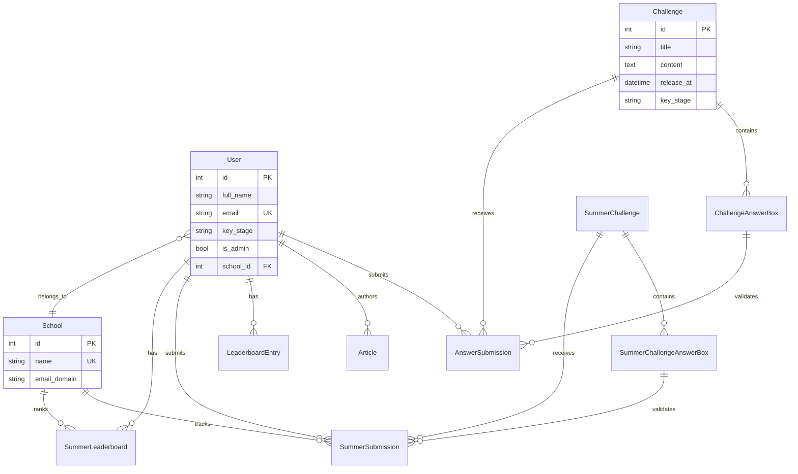

## Overview

The Maths Society Platform uses **SQLAlchemy ORM** to manage a relational database schema designed for educational challenges, user management, and content distribution. The schema supports two parallel competition systems: regular challenges and summer challenges.

## Entity Relationship Diagram



## Core Models

### User Model

Represents platform users (students, teachers, administrators).

**Location**: `app/models.py:9`

```python
class User(UserMixin, db.Model):
    __tablename__ = "users"
    
    id = db.Column(db.Integer, primary_key=True)
    full_name = db.Column(db.String(100), nullable=False, index=True)
    email = db.Column(db.String(120), unique=True, nullable=False, index=True)
    year = db.Column(db.Integer)
    maths_class = db.Column(db.String(100))
    password_hash = db.Column(db.String(128))
    is_admin = db.Column(db.Boolean, default=False, nullable=False)
    key_stage = db.Column(db.String(3), nullable=False, index=True)
    school_id = db.Column(db.Integer, db.ForeignKey('school.id'), 
                          nullable=True, index=True)
    is_competition_participant = db.Column(db.Boolean, default=False, 
                                          nullable=False)
```

**Fields:**

| Field | Type | Constraints | Description |
|-------|------|-------------|-------------|
| `id` | Integer | Primary Key | Unique user identifier |
| `full_name` | String(100) | Not Null, Indexed | User's full name |
| `email` | String(120) | Unique, Not Null, Indexed | Email for authentication |
| `year` | Integer | Nullable | Academic year/grade |
| `maths_class` | String(100) | Nullable | Mathematics class identifier |
| `password_hash` | String(128) | Nullable | Hashed password (Werkzeug) |
| `is_admin` | Boolean | Default: False | Admin privileges flag |
| `key_stage` | String(3) | Not Null, Indexed | Educational level (KS3, KS4, KS5) |
| `school_id` | Integer | Foreign Key, Indexed | Reference to School |
| `is_competition_participant` | Boolean | Default: False | Competition eligibility |

**Relationships:**

```python
submissions = db.relationship("AnswerSubmission", 
                             back_populates="user", 
                             lazy="dynamic", 
                             cascade="all, delete-orphan")

articles = db.relationship("Article", 
                          back_populates="author", 
                          lazy="dynamic", 
                          cascade="all, save-update")
```

**Methods:**

- `set_password(password)`: Hash and store password using Werkzeug
- `check_password(password)`: Verify password against stored hash

**Indexes:**
- `full_name`, `email`, `key_stage`, `school_id`

---

### Challenge Model

Represents mathematical challenges/problems for students.

**Location**: `app/models.py:49`

```python
class Challenge(db.Model):
    __tablename__ = "challenge"
    
    id = db.Column(db.Integer, primary_key=True, autoincrement=True)
    title = db.Column(db.String(100), nullable=False, index=True)
    content = db.Column(db.Text, nullable=False)
    date_posted = db.Column(db.DateTime, nullable=False, 
                           default=datetime.datetime.now, index=True)
    file_url = db.Column(db.String(100))
    key_stage = db.Column(db.String(3), nullable=False, index=True)
    first_correct_submission = db.Column(db.DateTime)
    release_at = db.Column(db.DateTime, nullable=True, index=True)
    is_manually_locked = db.Column(db.Boolean, default=False, nullable=False)
    lock_after_hours = db.Column(db.Integer, nullable=True)
```

**Fields:**

| Field | Type | Description |
|-------|------|-------------|
| `id` | Integer | Primary key |
| `title` | String(100) | Challenge title |
| `content` | Text | HTML/Markdown challenge description |
| `date_posted` | DateTime | Publication timestamp |
| `file_url` | String(100) | Optional PDF/attachment path |
| `key_stage` | String(3) | Target educational level |
| `first_correct_submission` | DateTime | Timestamp of first correct answer |
| `release_at` | DateTime | Scheduled release time |
| `is_manually_locked` | Boolean | Admin lock override |
| `lock_after_hours` | Integer | Auto-lock after X hours |

**Properties:**

```python
@property
def is_locked(self):
    """Check if challenge is locked (manually or by time)"""
    if self.is_manually_locked:
        return True
        
    if self.lock_after_hours and self.release_at:
        lock_time = self.release_at + timedelta(hours=self.lock_after_hours)
        return datetime.now() > lock_time
        
    return False
```

**Relationships:**

- `answer_boxes`: One-to-many with `ChallengeAnswerBox` (ordered)
- `submissions`: One-to-many with `AnswerSubmission`

---

### ChallengeAnswerBox Model

Defines answer fields within a challenge (multi-part questions).

**Location**: `app/models.py:97`

```python
class ChallengeAnswerBox(db.Model):
    __tablename__ = "challenge_answer_box"
    
    id = db.Column(db.Integer, primary_key=True, autoincrement=True)
    challenge_id = db.Column(db.Integer, db.ForeignKey("challenge.id"), 
                            nullable=False, index=True)
    box_label = db.Column(db.String(100), nullable=False)
    correct_answer = db.Column(db.String(100), nullable=False)
    order = db.Column(db.Integer, nullable=False)
```

**Composite Index**: `(challenge_id, order)` for efficient ordered retrieval

**Key Method**:

```python
def check_answer(self, submitted_answer: str) -> bool:
    """
    Check if the submitted answer is correct using mathematical 
    expression comparison or string matching.
    """
    try:
        from app.utils import compare_mathematical_expressions
        return compare_mathematical_expressions(submitted_answer, 
                                               self.correct_answer)
    except Exception:
        return submitted_answer.lower().strip() == \
               self.correct_answer.lower().strip()
```

---

### AnswerSubmission Model

Records user submissions for challenge answer boxes.

**Location**: `app/models.py:143`

```python
class AnswerSubmission(db.Model):
    __tablename__ = "answer_submission"
    
    id = db.Column(db.Integer, primary_key=True, autoincrement=True)
    user_id = db.Column(db.Integer, db.ForeignKey("users.id"), 
                       nullable=False, index=True)
    challenge_id = db.Column(db.Integer, db.ForeignKey("challenge.id"), 
                            nullable=False, index=True)
    answer_box_id = db.Column(db.Integer, 
                             db.ForeignKey("challenge_answer_box.id"), 
                             nullable=False, index=True)
    answer = db.Column(db.String(100), nullable=False)
    is_correct = db.Column(db.Boolean, nullable=True)
    submitted_at = db.Column(db.DateTime, nullable=False, 
                            default=datetime.datetime.now, index=True)
```

**Composite Indexes:**

```python
__table_args__ = (
    db.Index('ix_answer_submission_user_challenge', 'user_id', 'challenge_id'),
    db.Index('ix_answer_submission_challenge_submitted', 'challenge_id', 'submitted_at'),
)
```

These indexes optimize:
- User submission history queries
- Challenge leaderboard generation (recent submissions)

---

### School Model

Represents educational institutions participating in summer competitions.

**Location**: `app/models.py:239`

```python
class School(db.Model):
    __tablename__ = "school"
    
    id = db.Column(db.Integer, primary_key=True)
    name = db.Column(db.String(100), nullable=False, unique=True, index=True)
    email_domain = db.Column(db.String(100), nullable=True)
    address = db.Column(db.String(200), nullable=True)
    date_joined = db.Column(db.DateTime, default=datetime.datetime.now, 
                           nullable=False)
    
    users = db.relationship('User', backref='school', lazy='dynamic')
```

---

### Article Model

Stores educational content and newsletters.

**Location**: `app/models.py:175`

```python
class Article(db.Model):
    __tablename__ = "article"
    
    id = db.Column(db.Integer, primary_key=True)
    title = db.Column(db.String(100), nullable=False, index=True)
    file_url = db.Column(db.String(255))  # PDF file path
    content = db.Column(db.Text, nullable=False)
    named_creator = db.Column(db.String(100), nullable=True)
    date_posted = db.Column(db.DateTime, nullable=False, 
                           default=datetime.datetime.now, index=True)
    user_id = db.Column(db.Integer, db.ForeignKey("users.id"), 
                       nullable=False, index=True)
    type = db.Column(db.String(20), default="article", 
                    nullable=False, index=True)
```

**Property:**

```python
@property
def pdf_path(self):
    """Get the full path to the PDF file for newsletters."""
    if self.file_url and self.type == "newsletter":
        return os.path.join(
            current_app.config["UPLOAD_FOLDER"], 
            "newsletters", 
            self.file_url
        )
    return None
```

---

### LeaderboardEntry Model

Tracks user scores and rankings.

**Location**: `app/models.py:203`

```python
class LeaderboardEntry(db.Model):
    __tablename__ = "leaderboard_entry"
    
    id = db.Column(db.Integer, primary_key=True)
    user_id = db.Column(db.Integer, db.ForeignKey("users.id"), 
                       nullable=False, index=True)
    score = db.Column(db.Integer, default=0, nullable=False)
    last_updated = db.Column(db.DateTime, nullable=False, 
                            default=datetime.datetime.now, index=True)
    key_stage = db.Column(db.String(3), nullable=False, index=True)
```

**Composite Index**: `(key_stage, score)` for efficient leaderboard queries

---

## Summer Competition Models

<Info>
  The summer competition system is a parallel structure to the regular challenge system with school-based tracking and time-limited challenges.
</Info>

### SummerChallenge Model

**Location**: `app/models.py:255`

Similar to `Challenge` but with `duration_hours` instead of `lock_after_hours`:

```python
class SummerChallenge(db.Model):
    duration_hours = db.Column(db.Integer, default=24, nullable=False)
    
    @property
    def is_locked(self):
        return (self.is_manually_locked or 
                datetime.datetime.now() > self.date_posted + 
                timedelta(hours=self.duration_hours))
```

### SummerChallengeAnswerBox Model

**Location**: `app/models.py:303`

Identical structure to `ChallengeAnswerBox`, linked to `SummerChallenge`.

### SummerSubmission Model

**Location**: `app/models.py:349`

Extends `AnswerSubmission` with school tracking:

```python
class SummerSubmission(db.Model):
    school_id = db.Column(db.Integer, db.ForeignKey('school.id'), 
                         nullable=False, index=True)
    points_awarded = db.Column(db.Integer, default=0, nullable=False)
```

**Composite Indexes:**
- `(user_id, challenge_id)`
- `(school_id, points_awarded)` for school leaderboards

### SummerLeaderboard Model

**Location**: `app/models.py:383`

School-based leaderboard tracking:

```python
class SummerLeaderboard(db.Model):
    user_id = db.Column(db.Integer, db.ForeignKey('users.id'))
    school_id = db.Column(db.Integer, db.ForeignKey('school.id'))
    score = db.Column(db.Integer, default=0, nullable=False)
```

**Composite Indexes:**
- `(school_id, score)`
- `(score)` for overall rankings

---

### Announcement Model

Platform-wide announcements.

**Location**: `app/models.py:227`

```python
class Announcement(db.Model):
    __tablename__ = "announcement"
    
    id = db.Column(db.Integer, primary_key=True)
    title = db.Column(db.String(100), nullable=False)
    content = db.Column(db.Text, nullable=False)
    date_posted = db.Column(db.DateTime, nullable=False, 
                           default=datetime.datetime.now, index=True)
```

---

## Relationship Patterns

### Cascade Behaviors

<Tabs>
  <Tab title="Delete Cascade">
    **User → AnswerSubmission**: `cascade="all, delete-orphan"`
    
    When a user is deleted, all their submissions are automatically removed.
  </Tab>
  
  <Tab title="Save-Update Cascade">
    **User → Article**: `cascade="all, save-update"`
    
    Articles are updated when users are updated, but not deleted with users.
  </Tab>
  
  <Tab title="Backref Pattern">
    **User ↔ LeaderboardEntry**: `backref=db.backref("leaderboard_entries", cascade="all, delete-orphan")`
    
    Bidirectional relationship with cascade from User side.
  </Tab>
</Tabs>

### Lazy Loading Strategies

| Strategy | Use Case | Example |
|----------|----------|----------|
| `lazy="dynamic"` | Large collections, filtered queries | `User.submissions` |
| `lazy="select"` (default) | Small collections, eager loading | `School.users` |
| `lazy="joined"` | Frequently accessed together | N/A in current schema |

---

## Database Indexes

### Single-Column Indexes

Automatic indexes on:
- All primary keys
- All foreign keys
- Unique constraints (`User.email`, `School.name`)

Manual indexes:
- `User.full_name`, `User.key_stage`
- `Challenge.title`, `Challenge.date_posted`, `Challenge.release_at`
- `Article.title`, `Article.date_posted`, `Article.type`

### Composite Indexes

Optimized for common query patterns:

```python
# Answer submissions by user and challenge
db.Index('ix_answer_submission_user_challenge', 'user_id', 'challenge_id')

# Challenge submissions ordered by time
db.Index('ix_answer_submission_challenge_submitted', 
         'challenge_id', 'submitted_at')

# Leaderboard queries by key stage and score
db.Index('ix_leaderboard_entry_key_stage_score', 'key_stage', 'score')

# Summer leaderboard by school
db.Index('ix_summer_leaderboard_school_score', 'school_id', 'score')
```

---

## Migration Management

The platform uses **Flask-Migrate** (Alembic wrapper) for schema versioning:

```bash
# Generate migration
flask db migrate -m "Add summer challenge models"

# Apply migration
flask db upgrade

# Rollback
flask db downgrade
```

**Configuration** (`app/__init__.py:201`):

```python
migrate.init_app(app, db, render_as_batch=True)
```

<Warning>
  `render_as_batch=True` is required for SQLite compatibility (ALTER TABLE support).
</Warning>

---

## Query Examples

### Get User's Completed Challenges

```python
user = User.query.get(user_id)
completed_challenges = db.session.query(Challenge).join(
    AnswerSubmission
).filter(
    AnswerSubmission.user_id == user.id,
    AnswerSubmission.is_correct == True
).distinct().all()
```

### Leaderboard Query

```python
leaderboard = LeaderboardEntry.query.filter_by(
    key_stage="KS4"
).order_by(
    LeaderboardEntry.score.desc()
).limit(10).all()
```

### Check Challenge Lock Status

```python
challenge = Challenge.query.get(challenge_id)
if challenge.is_locked:
    # Prevent submissions
    pass
```

---

## Best Practices

<AccordionGroup>
  <Accordion title="Use Indexes Wisely">
    Add indexes to columns used in:
    - `WHERE` clauses (filters)
    - `ORDER BY` clauses (sorting)
    - `JOIN` conditions
    
    Over-indexing slows down writes!
  </Accordion>
  
  <Accordion title="Lazy Loading Configuration">
    Use `lazy="dynamic"` for collections that will be filtered:
    
    ```python
    # Good: Can filter submissions
    user.submissions.filter_by(is_correct=True).count()
    
    # Bad: Loads all submissions into memory
    user.submissions  # if lazy="select"
    ```
  </Accordion>
  
  <Accordion title="Cascade Deletes">
    Be explicit about cascade behaviors to prevent orphaned records or unintended deletions.
    
    - Use `delete-orphan` for true parent-child relationships
    - Avoid cascades for many-to-many or weak relationships
  </Accordion>
</AccordionGroup>

---

## Related Documentation

<CardGroup cols={2}>
  <Card title="System Architecture" icon="diagram-project" href="/architecture/overview">
    High-level system design
  </Card>
  <Card title="Math Engine" icon="calculator" href="/architecture/math-engine">
    Expression validation used in `check_answer()`
  </Card>
  <Card title="API Reference" icon="code" href="/api/models/user">
    Database query endpoints
  </Card>
  <Card title="Deployment" icon="server" href="/deployment/migrations">
    Database setup and migrations
  </Card>
</CardGroup>