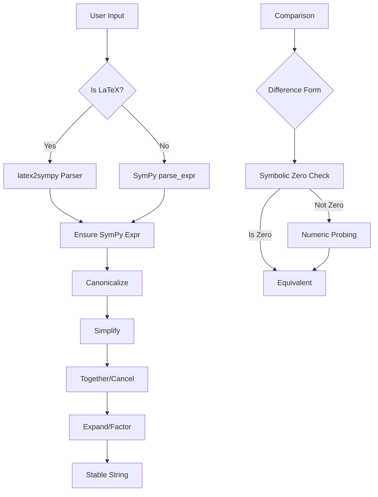

## Overview

The **Mathematical Expression Evaluation Engine** is a robust Python-based system designed for educational platforms. It handles complex mathematical expression comparison, normalization, and equivalence checking with support for both standard mathematical notation and LaTeX formatting.

**Location**: `app/utils/math_engine.py`

**Version**: 4.0

## Core Features

<CardGroup cols={2}>
  <Card title="Multi-Format Parsing" icon="language">
    Supports standard notation, LaTeX, and mixed inputs
  </Card>
  <Card title="Expression Equivalence" icon="equals">
    Detects mathematically equivalent expressions regardless of format
  </Card>
  <Card title="LaTeX Support" icon="subscript">
    Complete LaTeX parsing with `latex2sympy2` integration
  </Card>
  <Card title="Safe Evaluation" icon="shield">
    No `eval()` or `exec()` - uses SymPy's safe parsing
  </Card>
</CardGroup>

## Architecture



## Core Components

### ExpressionNormalizer Class

**Location**: `app/utils/math_engine.py:83`

The main class handling all mathematical expression operations.

```python
class ExpressionNormalizer:
    def __init__(self):
        self.transformations = (
            standard_transformations + 
            (implicit_multiplication_application,) + 
            (convert_xor,)
        )
        self.local_dict = {
            "log": sp.log,
            "ln": sp.log,
            "exp": sp.exp,
            "sqrt": sp.sqrt,
            "sin": sp.sin,
            # ... additional functions
        }
```

**Key Features:**
- **Transformations**: SymPy parsing transformations for robust interpretation
- **Local Dictionary**: Safe function mapping (no arbitrary code execution)

### Public API Methods

<Tabs>
  <Tab title="normalize_expression">
    **Convert expression to canonical form for comparison**
    
    ```python
    def normalize_expression(self, expression_str: str) -> str:
        try:
            expr = self._parse_to_sympy(expression_str)
            expr = self._canonicalize(expr)
            return self._to_stable_string(expr)
        except Exception as e:
            logger.warning(f"Normalization failed: {e}")
            return self._basic_string_normalization(expression_str)
    ```
    
    **Example**:
    ```python
    normalizer = ExpressionNormalizer()
    result = normalizer.normalize_expression("x^2 + 2*x + 1")
    # Returns: "(x + 1)**2" or "x**2 + 2*x + 1" (canonical form)
    ```
  </Tab>
  
  <Tab title="expressions_equivalent">
    **Check if two expressions are mathematically equivalent**
    
    ```python
    def expressions_equivalent(self, expr1: str, expr2: str) -> bool:
        try:
            e1 = self._parse_to_sympy(expr1)
            e2 = self._parse_to_sympy(expr2)
            
            diff = self._difference_form(e1, e2)
            if diff is None:
                return self._structural_equivalence(e1, e2)
            
            if self._is_zero_symbolically(diff):
                return True
            
            return self._numeric_equivalence(diff)
        except Exception as e:
            logger.error(f"Comparison failed: {e}")
            return False
    ```
    
    **Example**:
    ```python
    normalizer.expressions_equivalent("2*x + 3", "3 + 2*x")
    # Returns: True
    
    normalizer.expressions_equivalent("x^2 + 2*x + 1", "(x + 1)^2")
    # Returns: True
    ```
  </Tab>
  
  <Tab title="get_canonical_form">
    **Get canonical form for database storage**
    
    ```python
    def get_canonical_form(self, expression_str: str) -> str:
        try:
            expr = self._parse_to_sympy(expression_str)
            expr = self._canonicalize(expr)
            return self._to_stable_string(expr)
        except Exception as e:
            return self._basic_string_normalization(expression_str)
    ```
    
    Used in `ChallengeAnswerBox` for storing normalized correct answers.
  </Tab>
</Tabs>

## Parsing Strategies

### LaTeX Parsing with latex2sympy2

**Primary parser** for LaTeX expressions.

**Location**: `app/utils/math_engine.py:233`

```python
def _parse_to_sympy(self, expression_str: str) -> sp.Expr | Relational:
    s = expression_str.strip()
    self._validate_input_safe(s)  # Security check
    
    # Try latex2sympy first
    if LATEX2SYMPY_AVAILABLE:
        try:
            expr = latex2sympy(s)
            expr = _ensure_sympy_expr(expr)
            return expr
        except Exception as e:
            logger.debug(f"latex2sympy failed: {e}")
    
    # Fallback to SymPy parse_expr
    # ...
```

**Supported LaTeX Commands:**

| LaTeX | Meaning | Example |
|-------|---------|----------|
| `\frac{a}{b}` | Fraction | `\frac{x^2 + 1}{x + 1}` |
| `\sqrt{x}` | Square root | `\sqrt{x^2 + 2x + 1}` |
| `\left(`, `\right)` | Delimiters | `\left(a + b\right)` |
| `^{}` | Superscript | `x^{2}` |
| `_{}` | Subscript | `a_{n}` |
| `\sin`, `\cos`, `\tan` | Trig functions | `\sin(x) + \cos(x)` |
| `\log`, `\ln` | Logarithms | `\log(x) + \ln(y)` |
| `\cdot`, `\times` | Multiplication | `a \cdot b` |
| `\div` | Division | `a \div b` |

### LaTeX Cleanup Pipeline

**Location**: `app/utils/math_engine.py:282`

```python
def _minimal_latex_cleanup(self, s: str) -> str:
    # Remove math mode markers
    s = s.replace(r"\(", "").replace(r"\)", "")
    s = s.replace("$$", "").replace("$", "")
    
    # Normalize delimiters
    s = s.replace(r"\left", "").replace(r"\right", "")
    
    # Common aliases
    s = s.replace(r"\ln", r"\log")
    s = s.replace(r"\cdot", "*").replace(r"\times", "*")
    
    # Remove formatting commands
    s = re.sub(r"\\mathrm\{([^}]+)\}", r"\1", s)
    s = re.sub(r"\\operatorname\{([^}]+)\}", r"\1", s)
    
    return s
```

### SymPy Fallback Parser

When LaTeX parsing fails or input is standard notation:

```python
# Handle equations (split on "=")
if "=" in s and "==" not in s:
    left, right = s.split("=", 1)
    left_expr = parse_expr(left, local_dict=self.local_dict, 
                          transformations=self.transformations)
    right_expr = parse_expr(right, local_dict=self.local_dict, 
                           transformations=self.transformations)
    return sp.Eq(left_expr, right_expr)

# Standard expression parsing
expr = parse_expr(s, local_dict=self.local_dict, 
                 transformations=self.transformations, 
                 evaluate=False)
```

## Canonicalization Pipeline

**Location**: `app/utils/math_engine.py:325`

Transforms expressions into a stable, simplified form.

```python
def _canonicalize_expr(self, expr: sp.Expr) -> sp.Expr:
    try:
        e = expr
        
        # Basic algebraic simplifications
        e = sp.simplify(e)
        
        # Rational function handling
        e = sp.together(e)
        e = sp.cancel(e)
        
        # Logarithms and exponentials
        e = sp.expand_log(e, force=True)
        e = sp.logcombine(e, force=True)
        
        # Powers and products
        e = sp.powsimp(e, force=True, deep=True)
        e = sp.powdenest(e, force=True)
        
        # Expand then factor
        e = sp.expand_mul(e)
        e = sp.factor_terms(e)
        
        # Final simplify
        e = sp.simplify(e)
        
        # Sort terms consistently
        if hasattr(e, "as_ordered_terms"):
            e = sp.Add(*sorted(e.as_ordered_terms(), 
                              key=lambda t: sympy_str(t, order="lex")))
        
        return e
    except Exception:
        return expr
```

**Stages:**

1. **Simplify**: Basic algebraic simplification
2. **Together/Cancel**: Combine fractions, cancel common factors
3. **Expand/Combine Logs**: `log(a) + log(b) → log(a*b)`
4. **Power Simplification**: `(x^a)^b → x^(a*b)`
5. **Expand/Factor**: Expand products, factor common terms
6. **Sort Terms**: Lexicographic ordering for consistency

## Equivalence Checking

### Three-Stage Approach

<Steps>
  <Step title="Difference Form">
    Convert comparison to a zero-checking problem:
    
    - **Expr vs Expr**: `diff = e1 - e2`
    - **Eq vs Eq**: `diff = (lhs1 - rhs1) - (lhs2 - rhs2)`
    - **Eq vs Expr**: `diff = (lhs - rhs) - e`
    
    If `diff == 0`, expressions are equivalent.
  </Step>
  
  <Step title="Symbolic Zero Check">
    Use SymPy's symbolic algebra:
    
    ```python
    def _is_zero_symbolically(self, expr: sp.Expr) -> bool:
        e = self._canonicalize_expr(expr)
        if e == 0:
            return True
        
        e = sp.simplify(e)
        if e == 0:
            return True
        
        e = sp.together(e)
        e = sp.cancel(e)
        e = sp.simplify(e)
        return e == 0
    ```
  </Step>
  
  <Step title="Numeric Probing">
    If symbolic methods fail, test with random values:
    
    ```python
    def _numeric_equivalence(self, diff: sp.Expr, 
                            trials: int = 8, 
                            tol: float = 1e-9) -> bool:
        symbols = sorted(list(diff.free_symbols), key=lambda s: s.name)
        
        for _ in range(trials * 3):
            subs_map = {sym: random.choice(range(-5, 6)) 
                       for sym in symbols}
            
            try:
                val = diff.subs(subs_map)
                val = complex(val.evalf())
                
                if abs(val) > tol:
                    return False
            except Exception:
                continue  # Domain error, retry
        
        return True
    ```
    
    **Safety**: Skips division by zero, log of negative, etc.
  </Step>
</Steps>

## Security Features

<Warning>
  The math engine is designed to prevent code injection attacks. All expression parsing uses SymPy's safe methods with NO `eval()` or `exec()` calls.
</Warning>

### Input Validation

**Location**: `app/utils/math_engine.py:192`

```python
def _validate_input_safe(self, expression_str: str) -> None:
    """Block dangerous Python constructs"""
    dangerous_patterns = [
        r'\bexec\s*\(',
        r'\beval\s*\(',
        r'\b__import__\s*\(',
        r'\bcompile\s*\(',
        r'\bglobals\s*\(',
        r'\bgetattr\s*\(',
        r'\bopen\s*\(',
        r'\b__\w+__',
        r'import\s+',
        r'lambda\s+',
    ]
    
    s = expression_str.lower()
    for pattern in dangerous_patterns:
        if re.search(pattern, s, re.IGNORECASE):
            raise ValueError(f"Dangerous pattern detected: {pattern}")
```

### Safe Parsing Strategy

1. **Validate input** against dangerous patterns
2. **Use latex2sympy2** (no eval) or SymPy's `parse_expr` with restricted `local_dict`
3. **Ensure SymPy objects** - reject non-expression returns
4. **No sympify** on untrusted input (can execute code)

## Usage in Models

### ChallengeAnswerBox Integration

**Location**: `app/models.py:119`

```python
class ChallengeAnswerBox(db.Model):
    def check_answer(self, submitted_answer: str) -> bool:
        """
        Check if the submitted answer is correct.
        
        Uses mathematical expression comparison for mathematical 
        answer boxes, falls back to simple string comparison for 
        non-mathematical answers.
        """
        try:
            from app.utils import compare_mathematical_expressions
            return compare_mathematical_expressions(
                submitted_answer, 
                self.correct_answer
            )
        except Exception:
            # Fallback for non-math answers (e.g., text responses)
            return submitted_answer.lower().strip() == \
                   self.correct_answer.lower().strip()
```

### Global Helper Functions

**Location**: `app/utils/math_engine.py:541`

```python
# Global instance
math_normalizer = ExpressionNormalizer()

def compare_mathematical_expressions(user_answer: str, 
                                    correct_answer: str) -> bool:
    """Compare two mathematical expressions for equivalence."""
    return math_normalizer.expressions_equivalent(user_answer, 
                                                  correct_answer)

def normalize_expression_for_storage(expression: str) -> str:
    """Normalize an expression for consistent database storage."""
    return math_normalizer.get_canonical_form(expression)

def latex_to_sympy_string(latex_expr: str) -> str:
    """Convert LaTeX expression to SymPy string representation."""
    # Implementation...

def latex_to_simplified_latex(latex_expr: str) -> str:
    """Simplify a LaTeX expression and return simplified LaTeX."""
    # Implementation...
```

## Example Use Cases

### Basic Expression Comparison

```python
from app.utils.math_engine import compare_mathematical_expressions

# Commutative property
compare_mathematical_expressions("2*x + 3", "3 + 2*x")
# True

# Associative property
compare_mathematical_expressions("(a + b) + c", "a + (b + c)")
# True

# Distributive property
compare_mathematical_expressions("a*(b + c)", "a*b + a*c")
# True
```

### LaTeX Equivalence

```python
# LaTeX parentheses
latex1 = r"c\left(a+b\right)"
standard = "c*(a+b)"
compare_mathematical_expressions(latex1, standard)
# True

# LaTeX fractions
latex_frac = r"\frac{x^2 + 2x + 1}{x + 1}"
standard_frac = "(x^2 + 2*x + 1)/(x + 1)"
compare_mathematical_expressions(latex_frac, standard_frac)
# True

# Simplified result
compare_mathematical_expressions(latex_frac, "x + 1")  
# True (after cancellation)
```

### Algebraic Identities

```python
# Factored vs expanded
compare_mathematical_expressions("x^2 + 2*x + 1", "(x + 1)^2")
# True

# Difference of squares
compare_mathematical_expressions("x^2 - y^2", "(x - y)*(x + y)")
# True

# Logarithmic properties
compare_mathematical_expressions("log(a) + log(b)", "log(a*b)")
# True
```

### Trigonometric Identities

```python
# Pythagorean identity
compare_mathematical_expressions("sin(x)^2 + cos(x)^2", "1")
# True (with symbolic evaluation)

# Double angle
compare_mathematical_expressions("sin(2*x)", "2*sin(x)*cos(x)")
# True (with symbolic evaluation)
```

## Admin Testing Tool

The platform includes an interactive math engine tester accessible to admins:

**Route**: `/admin/math-engine-tester`

**Features:**
- Test two expressions for equivalence
- View normalized forms
- Debug parsing failures
- Test LaTeX inputs

**Screenshot Example:**

```
┌─────────────────────────────────────────┐
│ Math Engine Tester                      │
├─────────────────────────────────────────┤
│ Expression 1: x^2 + 2*x + 1             │
│ Expression 2: (x + 1)^2                 │
│                                         │
│ Result: ✓ Equivalent                    │
│                                         │
│ Normalized 1: (x + 1)**2                │
│ Normalized 2: (x + 1)**2                │
└─────────────────────────────────────────┘
```

## Performance Considerations

### Optimization Strategies

<AccordionGroup>
  <Accordion title="Symbol Caching">
    Pre-defined common symbols in `local_dict` to avoid repeated creation:
    
    ```python
    self.local_dict = {
        "log": sp.log,
        "sin": sp.sin,
        # ... more
    }
    ```
  </Accordion>
  
  <Accordion title="Transformation Reuse">
    Single transformation tuple for all parsing:
    
    ```python
    self.transformations = (
        standard_transformations + 
        (implicit_multiplication_application,) + 
        (convert_xor,)
    )
    ```
  </Accordion>
  
  <Accordion title="Early String Comparison">
    Quick check before expensive symbolic computation:
    
    ```python
    if expr1.strip() == expr2.strip():
        return True
    ```
  </Accordion>
</AccordionGroup>

### Complexity Analysis

| Operation | Best Case | Average Case | Worst Case |
|-----------|-----------|--------------|------------|
| String normalization | O(n) | O(n) | O(n) |
| SymPy parsing | O(n) | O(n²) | O(n³) |
| Canonicalization | O(n) | O(n²) | O(n³) |
| Symbolic zero check | O(1) | O(n) | O(n²) |
| Numeric probing | O(k) | O(k·n) | O(k·n) |

*Where n = expression complexity, k = trials (default 8)*

## Dependencies

### Required Packages

```python
sympy >= 1.12.0          # Symbolic mathematics
latex2sympy2             # LaTeX parsing (optional but recommended)
```

### Import Structure

```python
import sympy as sp
from sympy import Eq
from sympy.core.relational import Relational
from sympy.parsing.sympy_parser import (
    convert_xor,
    implicit_multiplication_application,
    parse_expr,
    standard_transformations,
)
from sympy.printing.str import sstr as sympy_str

try:
    from latex2sympy2 import latex2sympy, latex2latex
    LATEX2SYMPY_AVAILABLE = True
except ImportError:
    LATEX2SYMPY_AVAILABLE = False
```

## Testing

### Unit Test Examples

```python
import pytest
from app.utils.math_engine import ExpressionNormalizer

def test_basic_equivalence():
    normalizer = ExpressionNormalizer()
    assert normalizer.expressions_equivalent("2*x + 3", "3 + 2*x")
    assert normalizer.expressions_equivalent("x^2 + 2*x + 1", "(x+1)^2")

def test_latex_parsing():
    normalizer = ExpressionNormalizer()
    latex_input = r"c\left(a+b\right)"
    standard = "c*(a+b)"
    assert normalizer.expressions_equivalent(latex_input, standard)

def test_non_equivalence():
    normalizer = ExpressionNormalizer()
    assert not normalizer.expressions_equivalent("x + 1", "x + 2")
    assert not normalizer.expressions_equivalent("x^2", "x^3")
```

## Known Limitations

<Warning>
  - **Complex Trigonometric Identities**: Some advanced identities may not be recognized symbolically
  - **User-Defined Functions**: Requires explicit declaration in `local_dict`
  - **Infinite Series**: No support for series expansion
  - **Units/Dimensions**: No physical unit handling
</Warning>

## Future Enhancements

<CardGroup cols={2}>
  <Card title="Step-by-Step Solutions" icon="list-ol">
    Show transformation steps from input to canonical form
  </Card>
  <Card title="Graph Visualization" icon="chart-line">
    Plot expressions for visual verification
  </Card>
  <Card title="Custom Functions" icon="function">
    User-defined mathematical functions
  </Card>
  <Card title="Performance Caching" icon="bolt">
    Redis cache for frequently compared expressions
  </Card>
</CardGroup>

## Related Documentation

<CardGroup cols={2}>
  <Card title="Database Models" icon="database" href="/architecture/database-models">
    `ChallengeAnswerBox.check_answer()` integration
  </Card>
  <Card title="Admin Tools" icon="wrench" href="/admin/challenge-management">
    Using the math engine tester
  </Card>
  <Card title="API Reference" icon="code" href="/api/utils/math-engine">
    Math validation API endpoints
  </Card>
  <Card title="Security" icon="shield" href="/configuration/security">
    Input validation and safe evaluation
  </Card>
</CardGroup>