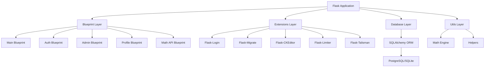
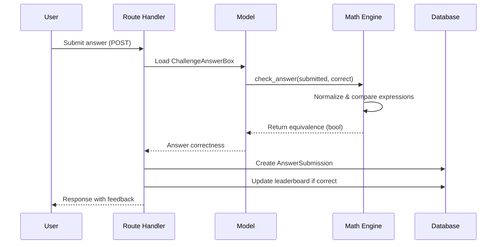
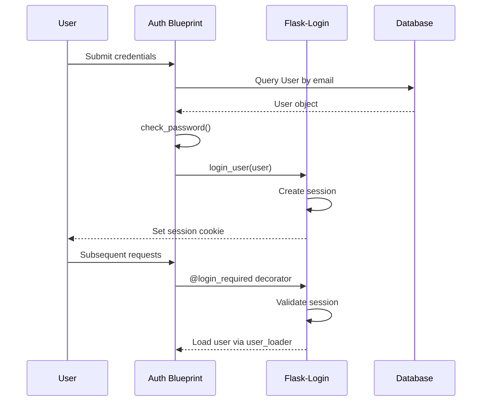

## Introduction

The Maths Society Platform is built using **Flask**, a lightweight Python web framework, following a modular blueprint architecture. The system is designed to support mathematical challenge competitions, user management, content publishing, and real-time leaderboards.

## Architecture Diagram



## Application Structure

### Project Layout

```
app/
├── __init__.py              # Application factory
├── models.py                # Database models
├── database.py              # Database initialization
├── main/                    # Main blueprint (public routes)
│   ├── __init__.py
│   └── routes.py
├── auth/                    # Authentication blueprint
│   ├── __init__.py
│   └── routes.py
├── admin/                   # Admin blueprint
│   ├── __init__.py
│   └── routes.py
├── profile/                 # User profile blueprint
│   ├── __init__.py
│   └── routes.py
├── math_api/                # Math validation API
│   └── __init__.py
└── utils/                   # Utility functions
    ├── __init__.py
    └── math_engine.py       # Expression evaluation engine
```

## Core Components

### Application Factory Pattern

The application uses the **factory pattern** for flexible configuration and testing:

```python title="app/__init__.py"
def create_app(config_name="development"):
    """
    Application factory with improved configuration management
    
    Args:
        config_name (str): Configuration environment 
                          ('development', 'testing', 'production')
    """
    config_class = get_config(config_name)
    app = Flask(__name__)
    app.config.from_object(config_class)
    
    configure_logging(app)
    initialize_extensions(app)
    register_blueprints(app)
    
    return app
```

**Benefits:**
- Environment-specific configurations
- Simplified testing with isolated app instances
- Clean dependency injection

### Blueprint Architecture

The application is divided into **5 blueprints**, each handling a specific domain:

<CardGroup cols={2}>
  <Card title="Main Blueprint" icon="house">
    Public-facing routes including challenges, articles, and leaderboards
  </Card>
  <Card title="Auth Blueprint" icon="lock">
    User authentication: login, registration, and logout
  </Card>
  <Card title="Admin Blueprint" icon="shield">
    Administrative functions for content and user management
  </Card>
  <Card title="Profile Blueprint" icon="user">
    User profile management and account settings
  </Card>
  <Card title="Math API Blueprint" icon="calculator">
    RESTful API for mathematical expression validation
  </Card>
</CardGroup>

See [Blueprint Structure](/architecture/blueprints) for detailed route documentation.

### Extension Layer

The platform leverages several Flask extensions:

| Extension | Purpose | Configuration |
|-----------|---------|---------------|
| **Flask-Login** | User session management | `login_manager` |
| **Flask-Migrate** | Database migrations | `migrate` |
| **Flask-CKEditor** | Rich text editing | `ckeditor` |
| **Flask-Limiter** | Rate limiting | `limiter` (200/day, 50/hour) |
| **Flask-Talisman** | Security headers (CSP, HTTPS) | `Talisman` |
| **SQLAlchemy** | ORM for database operations | `db` |

### Database Layer

The system uses **SQLAlchemy ORM** with support for:
- PostgreSQL (production)
- SQLite (development/testing)

All models are defined in `app/models.py` with proper relationships, indexes, and cascading behaviors.

See [Database Models](/architecture/database-models) for complete schema documentation.

## Design Patterns

### Model-View-Controller (MVC)

- **Models**: SQLAlchemy models in `app/models.py`
- **Views**: Jinja2 templates in `app/templates/`
- **Controllers**: Blueprint routes in `app/*/routes.py`

### Repository Pattern

Database operations are encapsulated within model methods:

```python
class ChallengeAnswerBox(db.Model):
    def check_answer(self, submitted_answer: str) -> bool:
        """Check if the submitted answer is correct."""
        try:
            from app.utils import compare_mathematical_expressions
            return compare_mathematical_expressions(
                submitted_answer, 
                self.correct_answer
            )
        except Exception:
            # Fallback to string comparison
            return submitted_answer.lower().strip() == \
                   self.correct_answer.lower().strip()
```

### Service Layer Pattern

Complex business logic is extracted to utility modules:

- **Math Engine** (`app/utils/math_engine.py`): Expression normalization and comparison
- **Authentication Helpers**: Password hashing, session management
- **File Upload Handlers**: Secure file processing

## Security Architecture

### Content Security Policy (CSP)

Strict CSP headers configured via Flask-Talisman:

```python
csp = {
    'default-src': ["'self'"],
    'script-src': ["'self'", "'unsafe-inline'", "https://cdn.jsdelivr.net"],
    'style-src': ["'self'", "'unsafe-inline'"],
    'img-src': ["'self'", "data:", "blob:"],
    # ... additional directives
}
```

### Rate Limiting

API endpoints are protected with rate limits:
- **Default**: 200 requests/day, 50 requests/hour
- **Custom limits**: Per-endpoint overrides for sensitive operations

### Input Validation

<Warning>
  All mathematical expressions are validated through the **Math Engine** to prevent code injection. The engine uses SymPy's safe parsing with no `eval()` or `exec()` calls.
</Warning>

See [Math Engine](/architecture/math-engine) for security details.

## Data Flow

### Challenge Submission Flow



### User Authentication Flow



## Configuration Management

Environment-specific configurations in `config.py`:

```python
class Config:
    """Base configuration"""
    SECRET_KEY = os.environ.get('SECRET_KEY')
    SQLALCHEMY_DATABASE_URI = os.environ.get('DATABASE_URL')
    
class DevelopmentConfig(Config):
    DEBUG = True
    SQLALCHEMY_ECHO = True
    
class ProductionConfig(Config):
    DEBUG = False
    SQLALCHEMY_ECHO = False
    # Additional production settings
```

## Health and Monitoring

The application exposes health check endpoints:

```python
@app.route('/healthz')
def healthz():
    return {"status": "ok"}, 200

@app.route('/readyz')
def readyz():
    try:
        db.session.execute(text('SELECT 1'))
        return {"status": "ready"}, 200
    except Exception:
        return {"status": "degraded"}, 503
```

## Error Handling

Centralized error handlers for common HTTP errors:

- **404 Not Found**: Custom template rendering
- **403 Forbidden**: Access denied page
- **500 Internal Server Error**: Automatic database rollback + error page

## Performance Considerations

### Database Optimization

- **Indexes**: Strategic indexes on frequently queried fields (see `app/models.py:403`)
- **Lazy Loading**: Dynamic relationships for efficient query patterns
- **Composite Indexes**: Multi-column indexes for complex queries

### Caching Strategy

<Info>
  Future enhancement: Implement Redis caching for:
  - Leaderboard queries
  - Challenge content
  - Frequently accessed articles
</Info>

## Deployment Architecture

### Production Stack

- **Application Server**: Gunicorn/uWSGI
- **Reverse Proxy**: Nginx (handles SSL, static files)
- **Database**: PostgreSQL with connection pooling
- **File Storage**: Local filesystem or S3-compatible storage
- **Process Management**: systemd or Supervisor

### Proxy Configuration

The application handles proxy headers correctly:

```python
from werkzeug.middleware.proxy_fix import ProxyFix
app.wsgi_app = ProxyFix(app.wsgi_app, x_for=1, x_proto=1, 
                        x_host=1, x_port=1)
```

## Next Steps

<CardGroup cols={2}>
  <Card title="Database Models" icon="database" href="/architecture/database-models">
    Explore the complete database schema and relationships
  </Card>
  <Card title="Blueprint Structure" icon="sitemap" href="/architecture/blueprints">
    Learn about routes and URL structure
  </Card>
  <Card title="Math Engine" icon="calculator" href="/architecture/math-engine">
    Deep dive into expression evaluation
  </Card>
  <Card title="API Reference" icon="code" href="/api/auth">
    API endpoints and integration guides
  </Card>
</CardGroup>