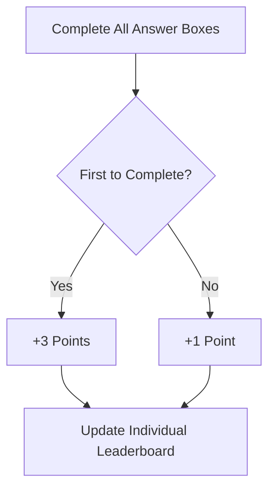

## Overview

The Summer Competition is a special competitive mode where students represent their schools in a time-limited mathematical challenge series. Unlike regular challenges, summer competition features school-based leaderboards, time-constrained problems, and a unique point structure.

<Note>
The Summer Competition runs as a separate mode from regular challenges. Summer competition participants have dedicated accounts and only access competition content during the event period.
</Note>

## Competition Structure

### School-Based Teams

The summer competition is built around schools:
- Students register with their school affiliation
- Individual scores contribute to school rankings
- Schools compete within key stage categories

### Key Stage Divisions

Just like regular challenges, competition is fair across academic levels:

<CardGroup cols={3}>
  <Card title="KS3 Division" icon="graduation-cap">
    Years 7-8 students
  </Card>
  
  <Card title="KS4 Division" icon="graduation-cap">
    Years 9-11 students
  </Card>
  
  <Card title="KS5 Division" icon="graduation-cap">
    Years 12-13 students
  </Card>
</CardGroup>

Each key stage has:
- Dedicated summer challenges
- Separate individual leaderboards
- Separate school rankings

## Summer Challenges

### Time-Limited Availability

Summer challenges have strict time constraints:
- **Release Time**: Challenges unlock at specific times
- **Duration**: Typically 24 hours from release
- **Automatic Locking**: Challenges lock when time expires

<Warning>
Once a summer challenge locks (either manually or when time expires), you cannot submit answers. Complete challenges quickly!
</Warning>

### Challenge Features

<AccordionGroup>
  <Accordion title="Multi-Part Problems">
    Each challenge contains multiple answer boxes representing different steps or parts of the problem.
  </Accordion>
  
  <Accordion title="File Attachments">
    Challenges may include PDF files with diagrams, graphs, or additional problem context.
  </Accordion>
  
  <Accordion title="Key Stage Filtering">
    You only see challenges for your registered key stage, ensuring appropriate difficulty.
  </Accordion>
  
  <Accordion title="Submission Tracking">
    Track your 3 attempts per answer box with immediate feedback on correctness.
  </Accordion>
</AccordionGroup>

## Scoring System

### Individual Points

Summer competition uses a different point structure than regular challenges:

<Steps>
  <Step title="Complete All Parts">
    Submit correct answers for every answer box in the challenge
  </Step>
  
  <Step title="First Completion Bonus">
    **+3 points** if you're the first student (across all key stages) to complete the entire challenge
  </Step>
  
  <Step title="Standard Completion">
    **+1 point** for completing the challenge after another student
  </Step>
</Steps>

<Note>
No points are awarded for partial completion. You must answer all parts correctly to earn points.
</Note>

### School Rankings

Schools are ranked by:
- **Total Points**: Sum of all student points from that school
- **Participant Count**: Number of active students
- **Average Score**: Mean points per participant

Rankings are calculated separately for each key stage.

## Leaderboards

### Individual Summer Leaderboard

The summer competition individual leaderboard displays:

<CardGroup cols={2}>
  <Card title="Top 15 Per Key Stage" icon="ranking-star">
    Leading students in KS3, KS4, and KS5 divisions
  </Card>
  
  <Card title="Student Details" icon="user">
    Name, school affiliation, and total score
  </Card>
  
  <Card title="Recent Activity" icon="clock">
    Latest 15 successful submissions with points awarded
  </Card>
  
  <Card title="Live Updates" icon="bolt">
    Real-time ranking changes as challenges are completed
  </Card>
</CardGroup>

### School Leaderboard

Schools compete within their key stage division:

**Top 8 Schools** displayed per key stage showing:
- School name
- Total points (sum of all student scores)
- Participant count
- Average score per student

This encourages both individual excellence and team participation.

## Competition Statistics

The summer leaderboard provides comprehensive metrics:

<AccordionGroup>
  <Accordion title="Participation Stats">
    - Total participants across all key stages
    - Breakdown by KS3, KS4, KS5
    - Number of participating schools
  </Accordion>
  
  <Accordion title="Activity Metrics">
    - Total submissions attempted
    - Correct submissions count
    - Total points awarded
    - Active challenges currently open
  </Accordion>
</AccordionGroup>

## Account Types

### Summer Competition Participants

Students registered for summer competition:
- Only see summer competition challenges
- Cannot access regular platform challenges during competition
- Must be affiliated with a school
- Contribute to both individual and school rankings

### Account Requirements

To participate, students need:
- **School Affiliation**: Valid school_id in their account
- **Key Stage**: Registered KS3, KS4, or KS5 level
- **Competition Flag**: `is_competition_participant` set to true

<Note>
Administrators can view and manage all content across both regular and summer competition modes.
</Note>

## Time Management

### Challenge Duration

Most summer challenges are available for **24 hours** after release:

<Steps>
  <Step title="Release">
    Challenge becomes visible at the scheduled release time
  </Step>
  
  <Step title="Active Period">
    Students have the duration_hours (typically 24h) to complete it
  </Step>
  
  <Step title="Automatic Lock">
    Challenge locks when time expires or manually by administrators
  </Step>
</Steps>

### Lock States

Challenges can be locked in two ways:

1. **Manual Lock**: Administrator closes the challenge early
2. **Time Expiration**: Duration_hours passes from release_at timestamp

## Submission Workflow

<Steps>
  <Step title="Choose Your Challenge">
    Browse available summer challenges for your key stage
  </Step>
  
  <Step title="Work Through Parts">
    Read the problem and solve each answer box sequentially
  </Step>
  
  <Step title="Submit Answers">
    Enter your solution for each part (3 attempts per box)
  </Step>
  
  <Step title="Immediate Feedback">
    See if your answer is correct and how many attempts remain
  </Step>
  
  <Step title="Complete Challenge">
    Get all parts correct to earn points for yourself and your school
  </Step>
</Steps>

## Points Flow

### Individual Scoring

### School Scoring

When you earn points:
1. Points added to your individual summer leaderboard entry
2. School's total score increases by the same amount
3. School ranking recalculates across all schools in your key stage
4. Your activity appears in the recent activity feed

## Tips for Success

<AccordionGroup>
  <Accordion title="Act Fast on Releases">
    Check for new challenges frequently. Being first to complete earns 3x the points.
  </Accordion>
  
  <Accordion title="Complete Before Lock Time">
    Don't wait until the last minute - challenges lock exactly when the duration expires.
  </Accordion>
  
  <Accordion title="Represent Your School Well">
    Your points contribute to school rankings, so every completion helps your team.
  </Accordion>
  
  <Accordion title="Use Attempts Wisely">
    With only 3 attempts per part and time pressure, work carefully and double-check calculations.
  </Accordion>
  
  <Accordion title="Watch for Key Stage Match">
    You can only attempt challenges for your registered key stage - make sure you're in the right division.
  </Accordion>
</AccordionGroup>

## Differences from Regular Mode

| Feature | Regular Challenges | Summer Competition |
|---------|-------------------|--------------------|
| **Account Type** | Standard users | Competition participants |
| **Time Limit** | Optional/varied | Strict (typically 24h) |
| **School Affiliation** | Optional | Required |
| **Leaderboard** | Individual only | Individual + School |
| **Points (First)** | +3 | +3 |
| **Points (Other)** | +1 | +1 |
| **Challenge Access** | By key stage | By key stage (competition set) |
| **Lock Behavior** | Manual or time-based | Automatic after duration |

## Next Steps

<CardGroup cols={2}>
  <Card title="View Leaderboards" icon="ranking-star" href="/features/leaderboards">
    Compare summer competition rankings with regular leaderboards
  </Card>
  
  <Card title="User Management" icon="user-gear" href="/features/user-management">
    Learn how to manage your account and switch between competition modes
  </Card>
</CardGroup>